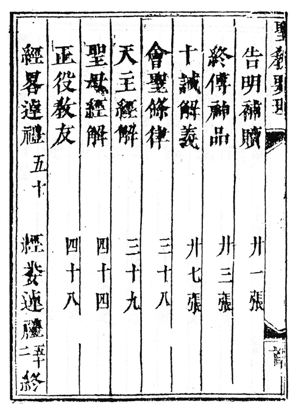
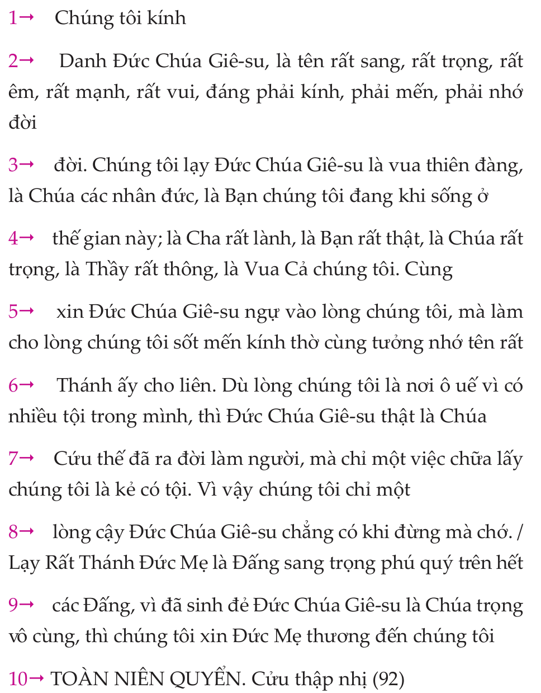

# Multimodal Alignment

MMA utilizes the similarity of multilingual sentence embeddings through LASER to assess sentence similarity. In combination with the transliteration tool, MMA works with the Sino-Nôm script, which is not supported by LASER, by transliterating it into Vietnamese.

## MMA Installation

You can build an environment using conda as follows:

```
    conda env create -f environment.yml
```
You can install [LASER Language-Agnostic Sentence Representations (LASER)](https://github.com/facebookresearch/LASER) toolkit from Facebook here which is used to embed sentences in each document.

Then set the environment variables in your workspace
```
    - LASER=${HOME}/projects/LASER
```

## Run Tool
```
conda activate mm_align
python alignment.py --src src_path --tgt tgt_path -o output_path
```

### Variables Meaning

* --src : path to source pdf (NS) file.

* --tgt : path to target (QN) file.

* -o : output file contain pairs of sentences that are aligned and semi-corrected.

### IMPORTANT NOTE
* pages in source file and target file MUST have the format as the following example:
   
* please modify the two function `preprocessing.sinonom_pdf_helper.extract_pages()` and `preprocessing.vietnamese_pdf_helper.extract_pages()` to match your OWN input.

